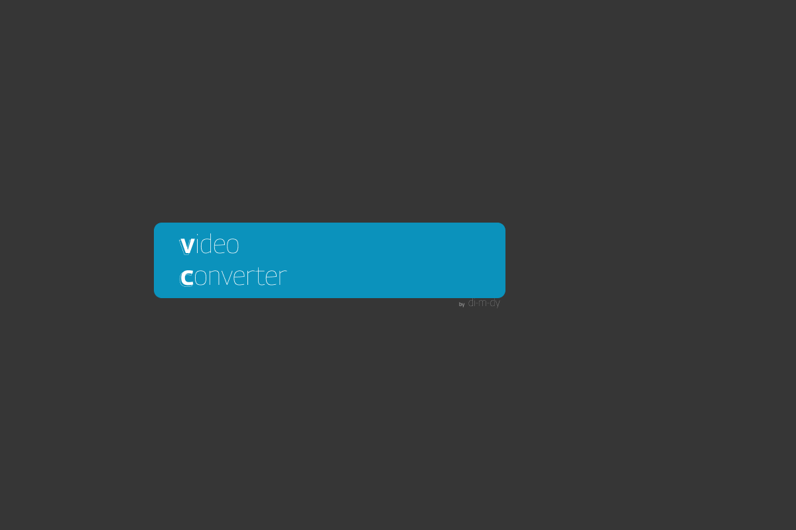
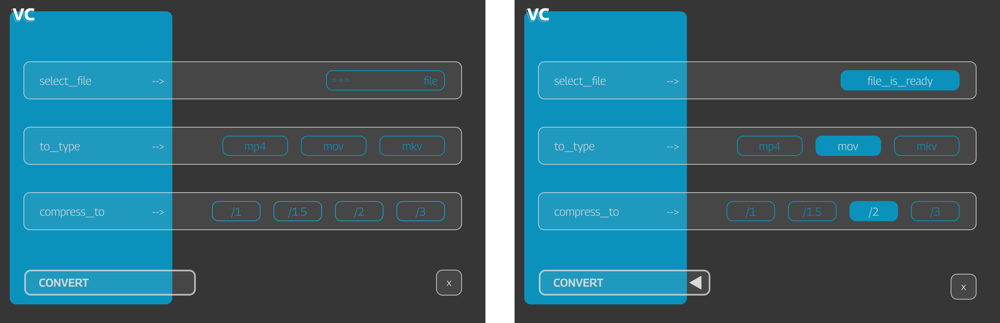
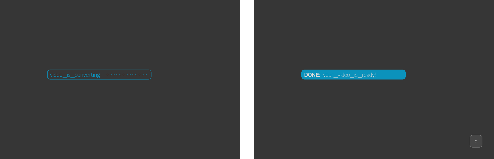
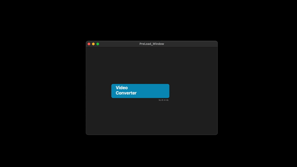

# Simple Video Converter

[Русский - README](README_ru.md) | [English - README](README.md)


## Project Description

A simple video converter using `ffmpeg` with a concise and user-friendly graphical interface built with `customtkinter`.





### Idea

Sometimes, you need to quickly and easily convert video files without delving into complex video editing software. Such situations occurred at an agency where I worked. Often, the SMM department received content from various photographers in "god-knows-what" formats. The task seemed simple, but minimizing the time spent on using "complex" software was desired. FFMPEG is ideal in this regard. Therefore, to spare colleagues from using the command line, I created a simple desktop application where, at worst, you need to press 5 buttons, and at best, just 2. A pleasant interface makes everything clear and simple!



### How to Use or "The 5 Button Rule":

1. Select the desired ***file*** from the menu. If a non-video file is selected, the program will politely notify you.
2. Choose the ***file format*** to convert to. I chose the 3 most popular formats in my opinion. If desired, you can use my code as a template and add your own options.
3. Choose the ***compression ratio***: compress by one and a half, two, or three times. The same idea as in the previous point. Everything is done so that you can quickly select and get the result.
4. Enable ***rotation*** for videos shot in vertical orientation.
5. Click the ***convert button*** and find the finished video in the same location as the original but in an automatically created directory named CONVERT_DONE.

! You can simply select a file and click CONVERT - the program will choose the default parameters!

### Installation Instructions

The most important thing is to install or download the executable files ffmpeg and ffprobe respectively. You can manually specify the path, or if you are sure they were previously installed, the program will find these files itself.

For the project itself, you need:

1. Clone the repository and create a virtual environment.
2. Install the GUI library:

[Customtkinter is the best: https://github.com/TomSchimansky/CustomTkinter.git](https://github.com/TomSchimansky/CustomTkinter.git)

```bash
pip install customtkinter
```

3. If necessary, specify the path to ffmpeg and ffprobe in `config.py`.
4. If necessary, install the program using the `pyinstaller` library.

[Link to instructions:  https://pyinstaller.org](https://pyinstaller.org/en/stable/)

## Usage

I will be glad if my code is useful to someone: either in practical application or as educational material. 
Feel free to use it!