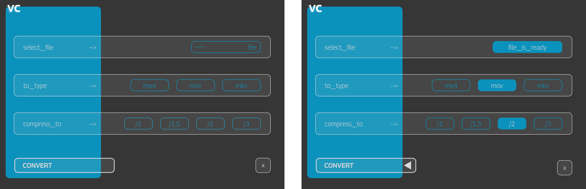

# Simple Video Converter


[Русский - README](README_ru.md) | [English - README](README.md)

## Описание проекта

Простой видео конвертер на `ffmpeg` с локаничным и понятным графическим интерфейсом на `customtkinter`.





### Идея

Бывают ситуации, когда нужно быстро и просто (без всякого изучения сложного софта по обработке видео) переконвертировать видео. Такие ситуации случались в одном агентстве, в котором я работал. Часто отделу smm скидывали контент разных фотографов в “бог-знает-каком” формате. Вроде задача простая, но хотелось свести к минимуму время затраченное, на включение “сложных” софтов и инструмент всеядный и быстрый. FFMPEG - в этом плане идеален. Поэтому чтобы не мучать коллег командной строкой - сделал простенькое десктопное приложение, в котором в худшем случае надо было нажать 5 кнопок, в лучшем всего 2. Приятный интерфейс и все понятно и просто! (Спасибо ~~Богу~~ [CustomTkinter](https://github.com/TomSchimansky/CustomTkinter.git) за это!)


### Как пользоваться или «правило 5 кнопок»:

1. Выбираем в меню нужный ***файл***. Если выбор пал не на видеофайл - программа вежливо вам это подскажет.
2. Выбрать ***формат файла*** в который конвертировать. Выбрал 3 самых на мой взгляд популярных. При желании можно использовать как шаблон мой код и добавить свои варианты.
3. Выбрать ***коофицент сжатия***: сжать в полтора, два или три раза.  Та же самая история что и в предыдущем пункте. Все сделано для того чтобы быстрее можно было ткнуть и получить результат.
4. Включить ***разворот*** видео: это для видео, снятых в вертикальном положении.
5. Кликаем на ***кнопку convert*** и ищем готовое видео в том же месте, что и оригинал но в автоматически созданной директории CONVERT_DONE.

! Можно выбрать только файл и ткнуть на CONVERT - программа выберет параметры по умолчанию!

### Инструкция по установке

Самое главное установить или скачать исполняющие файлы ffmpeg и ffprobe соответственно. Вы можете в ручную прописать путь или если уверены что ранее устанавливали - программа сама найдет эти файлы.

Для самого проекта необходимо:

1. Клонировать репозиторий и создать виртуальное окружение.
2. Установить библиотеку для GUI:

```bash
pip install customtkinter
```

3. Прописать при необходимости в  `config.py` путь до ffmpeg и ffprobe.
4. При необходимости инсталлировать программу с помощью библиотеки `pyinstaller`.

## Полезные ссылки

[Customtkinter is the best: https://github.com/TomSchimansky/CustomTkinter.git](https://github.com/TomSchimansky/CustomTkinter.git)

[Link to Pyinstaller instructions:  https://pyinstaller.org](https://pyinstaller.org/en/stable/)
## Использование

 Буду рад если мой код кому-то пригодится: либо в прикладном применении, либо в качестве обучающего материала. 
 Пользуйтесь на здоровье!